# Digital Image Processing Class

This is the class photo of the Digital Image Processing class for BERR 25/26 which recorded how i learn DIP within our lecture PROFESOR MADYA DR. NURULFAJAR BIN ABD. MANAP. 

***

# Reflection for DIP Class

## Section 2: Introduction 
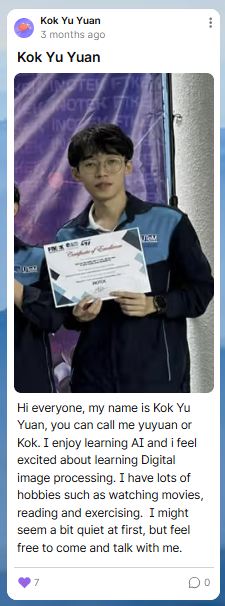
During the introduction of the course, we were requested to start recording a Padlet for the individual assignment. This Padlet acts as a living document of our learning journey and will be integrated into this digital portfolio to showcase our progress.

---

## Section 3: First activity in testing Ai generate images
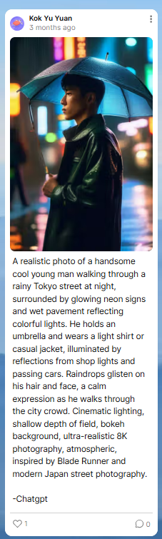

Our first class activity involved testing AI tools for image generation. We experimented with creating images using AI prompts and then showcased our generated results to the rest of the class. This exercise provided hands-on experience with the capabilities of generative AI in the context of digital imagery.

---

## Section 4: Fundamentals of Digital Image Processing
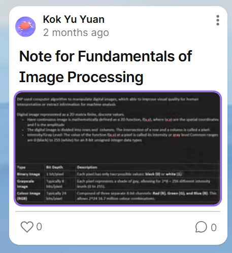
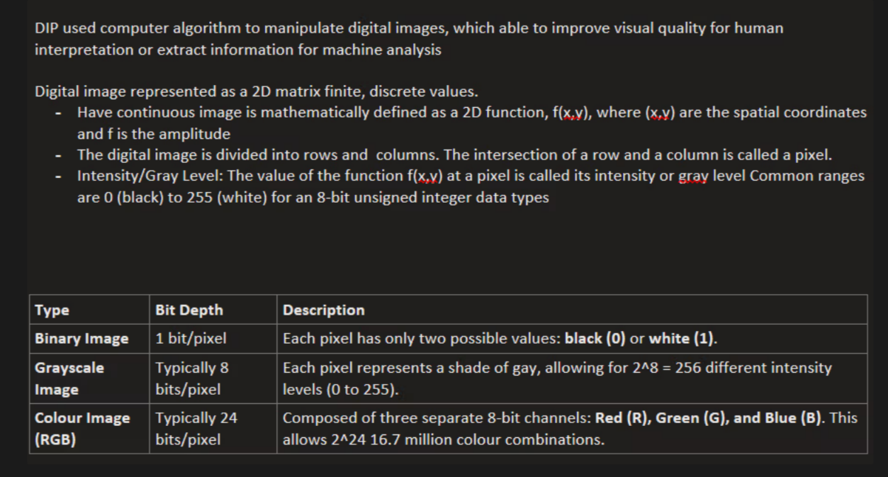

**My Class Notes (posted in padlet for fundamentals of digital image processing):**

*   **What is a Digital Image?**
    *   It's a representation of a 2D image as a finite set of digital values (pixels).
    *   $f(x, y)$ where $x, y$ are spatial coordinates and the amplitude is intensity.

*   **Key Concepts Learned:**
    1.  **Sampling:** Digitizing the coordinate values (spatial resolution).
    2.  **Quantization:** Digitizing the amplitude values (intensity resolution).
    3.  **electromagnetic spectrum:** The range of frequencies of electromagnetic radiation and their respective wavelengths and photon energies.
    4.  **Relationships between Pixels:** Neighbors ($N_4$, $N_8$), Adjacency (4-adjacency, 8-adjacency, m-adjacency), and Distance measures (Euclidean, City-block, Chessboard).

*   **Takeaway:** Understanding these fundamentals is crucial because all image processing algorithms rely on manipulating these discrete pixel values and their spatial relationships.

---

## Section 5: Image Enhancement
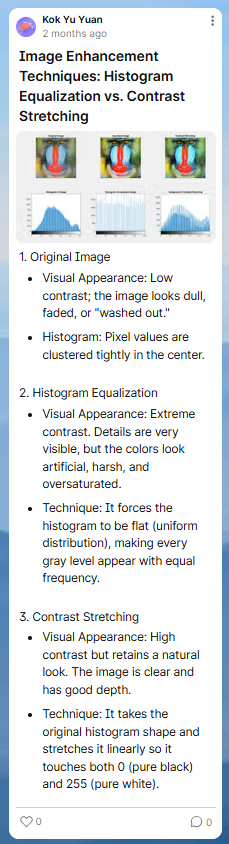

Explored techniques to improve image quality for human perception or machine analysis. Key learnings included Point Processing operations (like Contrast stretching and Gamma correction) and Histogram Equalization for contrast enhancement. We also delved into Spatial Filtering using convolution masks—smoothing filters for noise reduction and sharpening filters (Laplacian, Unsharp masking) to highlight edges.

---

## Section 6: Color Image restoration
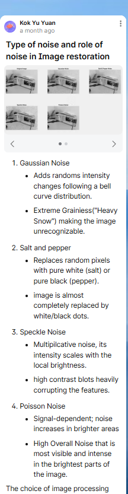
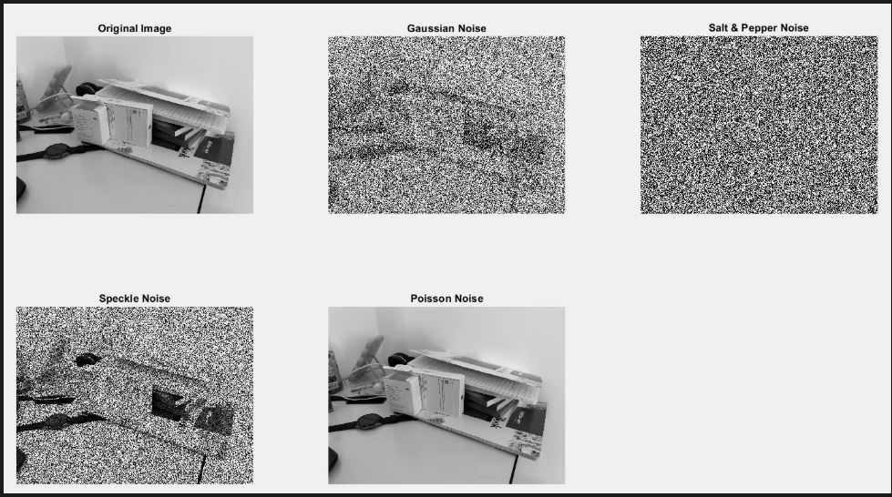
Investigated methods to recover the original color image from degraded versions. Understanding noise models in color channels was critical. We learned that noise often affects intensity and color channels differently. Techniques involved multichannel filtering and restoring color consistency, which is vital for robust computer vision applications in varying lighting conditions.

---

## Section 7: Reflection for pass 8 weeks
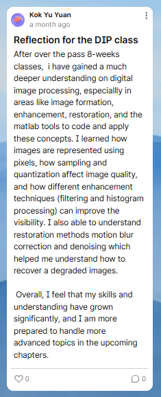
**Mid-semester Review:** The first eight weeks have been a rigorous journey from basic pixel manipulation to complex domain transformations. The transition from spatial to frequency domain understanding was challenging but rewarding. This period emphasized the importance of mathematical foundations—Fourier transforms and probability distributions—in solving practical modification tasks. I've developed a stronger intuition for "thinking in matrices" when processing visual data.

---

## Section 8: Geometric Transformations
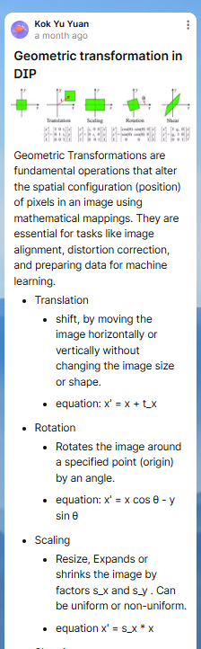
Studied the geometric relationship between pixel coordinates. We learned about Affine transformations (scaling, rotation, translation, shearing) and the crucial role of Interpolation (Nearest Neighbor, Bilinear, Bicubic) in preventing artifacts during resizing. Understanding these is fundamental for tasks like image registration and correcting perspective distortions.

---

## Section 9: Color image processing
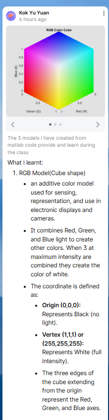
Deep dived into the physics and psychology of color. We differentiated between RGB (hardware-oriented) and HSI (human-perception oriented) models. Processing techniques included Pseudo-color processing (assigning colors to gray values) and Full-color processing (operating directly on vector pixels). This section highlighted how separating intensity/luminance from chromaticity can simplify many segmentation and enhancement tasks.

---

## Section 10: wavelet and other transformation
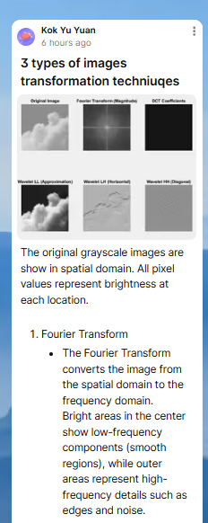
Moved beyond Fourier to Wavelets, enabling simultaneous time-frequency analysis (or space-frequency for images). We explored Multi-resolution Analysis (MRA) using image pyramids and subband coding. This ability to analyze an image at different scales is a powerful tool for feature extraction and is the backbone of modern compression standards like JPEG 2000.

---

## Section 11: Image compression
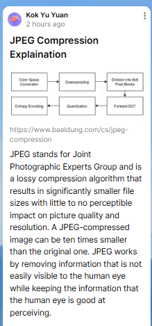            
Analyzed the trade-offs between image quality and storage size. We studied the three types of redundancy: coding, interpixel, and psychovisual. The distinction between Lossless (Huffman, LZW) and Lossy compression (DCT-based JPEG) was a key takeaway. Understanding the discrete cosine transform (DCT) and quantization steps clarified how digital media is efficiently transmitted over the web.

---

## Section 12: Miscellaneous
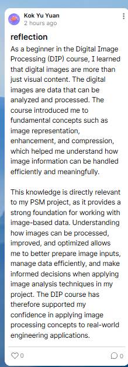    
The feeling and reflection of the class is that it is a very good class to learn digital image processing. The class is very well structured and the professor is very knowledgeable. The class is also very interactive and the professor is very good at explaining the concepts. I express the feeling and understand in this padlet.

***
# Personal Reflection: Learning Digital Image Processing from a Beginner’s Perspective
## end of the semester reflection

At the beginning of the semester, I had very little knowledge of Digital Image Processing. To me, an image was simply a collection of pixels, and I did not fully understand how computers interpret or manipulate images. Concepts such as noise, filtering, color spaces, and image enhancement were unfamiliar and initially confusing. I found it challenging to connect mathematical formulas and theoretical explanations to actual image results.

As the semester progressed, I gradually began to understand the fundamentals of digital images, including pixel intensity, grayscale representation, and basic image operations. Through lectures, demonstrations, and guided exercises, I learned how noise affects image quality and why preprocessing steps such as filtering are necessary. Applying techniques like median filtering and image smoothing helped me visually see the difference between raw and processed images, which significantly improved my understanding.

Interaction with classmates during discussions and assignments played an important role in my learning process. By sharing ideas and asking questions, I was able to clarify my misunderstandings and learn alternative approaches to solving image processing problems. Group discussions helped me realize that there is often more than one correct method to enhance an image, and the choice of technique depends on the image condition and the desired outcome.

One of the most meaningful learning experiences was working on the night landscape image enhancement project. Initially, I struggled to improve image clarity without distorting colors. However, through feedback from peers and applying knowledge learned in class, I learned how to use appropriate preprocessing techniques and color space transformations to enhance brightness while preserving natural color appearance. This project marked a turning point where theoretical knowledge became practical understanding.

By the end of the semester, I transformed from a beginner with no background in Digital Image Processing into a learner who can confidently apply basic image processing techniques. More importantly, I developed problem-solving skills, critical thinking, and the ability to justify technical decisions. This learning journey has motivated me to further explore image processing and computer vision in future studies.
