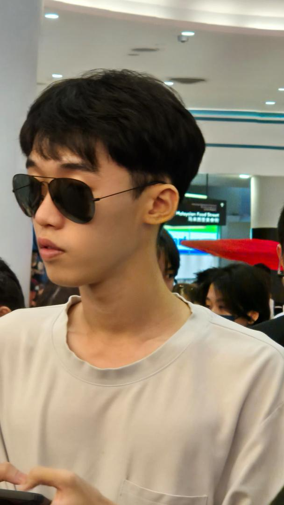

<h1>Kok Yu Yuan</h1>

<h2>Engineering & AI Portfolio</h2>

Machine Learning · IoT · Embedded Systems · Cybersecurity

  <a href="./projects">View Projects</a>
  <a href="./resume_Kok_Yu_Yuan.pdf" target="_blank">Download CV</a>

  

---

## 🚀 What I Do
I design and develop **intelligent engineering systems** that integrate  
**machine learning, embedded hardware, and data-driven analysis** to solve real-world problems.

---

## 🛠 Core Expertise

### 🤖 Machine Learning
CNN, ResNet, Isolation Forest, DBSCAN, K-Means

### 📡 IoT & Embedded Systems
STM32, FreeRTOS, Sensors, Real-time monitoring

### 🔐 Cybersecurity
Threat modeling, authentication, secure system design
